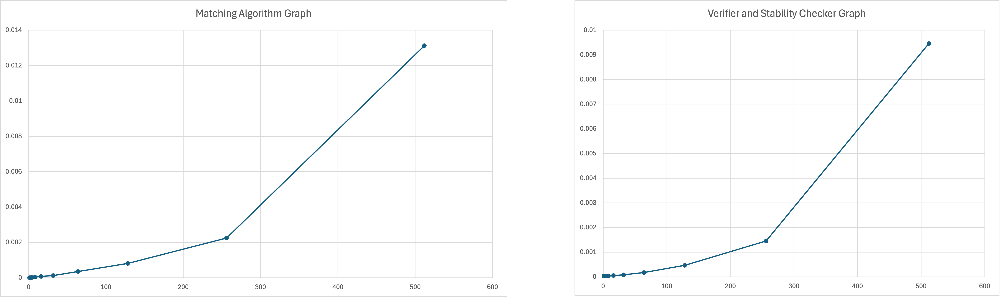

# COP4533 Programming Assignment 1 G-S

## Authors
* Shane Downs
    * UFID: 92052913
* Shashank Gutta
    * UFID: 70100558

## Project Structure
```
Algorithm-Homework-1/
├── input/
│   ├── basic_stable_input.txt
│   ├── detect_unstable_in...
│   ├── input_example...
│   ├── large_stable.txt
│   └── nequalsoneinputIN...
├── output/
│   ├── basic_stable.out
│   ├── example.out
│   └── large_stable.out
├── src/
│   ├── Matching_Engine.py
│   ├── Measure_Runtimes.py
│   └── Verifier.py
├── .gitignore
└── README.md
```

## Procedure: Task A
* Ensure you are using a Python interpreter version 3.9 or higher (if you choose to run the Measure_Runtimes.py module which is not required for this assignment, add `matplotlib` as a dependency: `pip3 install matplotlib`)
* Clone the repository onto your local machine

### How to Run
```bash
python3 "src/Matching_Engine.py"
```
Specify the input file you want to use as the CLI argument (see example below)
### Example
```bash
python3 "src/Matching_Engine.py" input/basic_stable_input.txt
```

Once this is completed, check `output` directory for the output file. You can rename the output filename as a global variable at the top of the `Matching_Engine.py` code

## Procedure: Task B
The Verifier (`src/Verifier.py`) checks the output of the Matching Engine for:

1. **Validity:** Each hospital and each student is matched to exactly one partner, with no duplicates.
2. **Stability:** Confirms there is no blocking pair.

### Output
- `VALID` followed by `STABLE` if the matching is valid and stable
- `INVALID` with a reason (e.g., `Wrong number of hospitals in matches`, `Duplicate or missing students in matches`, `Invalid hospital ids`, `Invalid student ids`) if the matching is not valid
- `UNSTABLE: Hospital {h} and student {s} form blocking pair` if the matching contains a blocking pair

### How to Run
```bash
python3 src/Verifier.py input/large_stable.txt output/large_stable.out
```
The first CLI argument is the name of the input file and the second argument is the output file destination as formatted above

## Task C
### IMPORTANT: Measure_Runtimes.py is functional but producing bad output. Please refer to our Excel graph to see completion of Task C


Obeservation: Both the matching algorithm and the verifier increase in running time with
the increase in input size. Both increase roughly by the same size